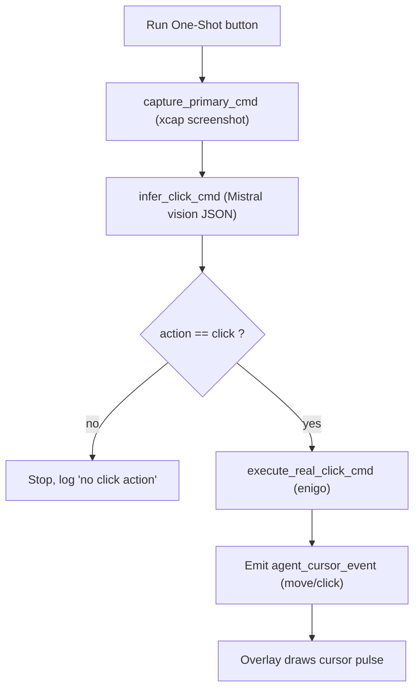
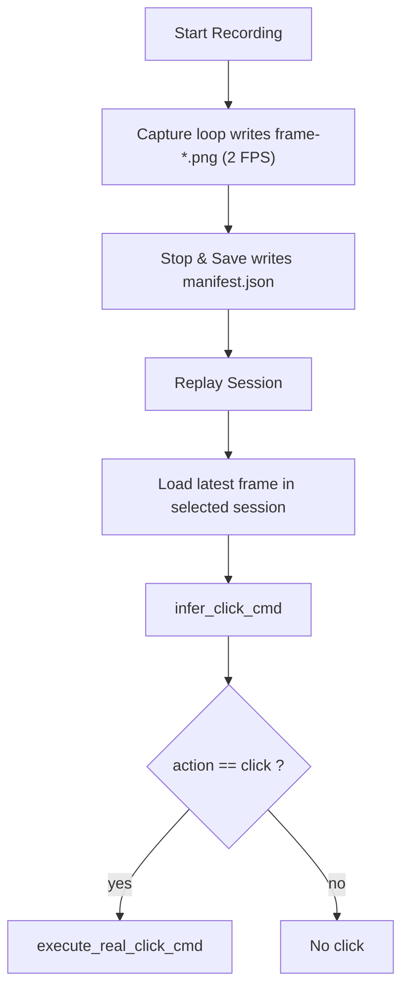

# Agenticify

OS-native vision automation app built with Tauri (Rust backend) + React (frontend).

## What Works Right Now

- Real screen capture with `xcap`.
- Real Mistral vision inference (`infer_click_cmd`).
- Real OS mouse click actuation with `enigo` (`execute_real_click_cmd`).
- Real session recording to disk (`start_recording_session_cmd` / `stop_recording_session_cmd`).
- Real session replay from saved frames (`replay_recording_session_cmd`).
- Transparent always-on-top overlay window with visual agent cursor.
- Overlay spans the virtual desktop bounds across monitors (not just app window monitor).
- macOS permission checks/prompts for:
  - Screen Recording
  - Accessibility
- Safety controls:
  - Global kill switch: `Cmd+Shift+Esc`
  - Restore main window: `Cmd+Shift+Enter`
  - max action cap (30) with auto E-STOP.

## How Components Communicate

1. React UI triggers Tauri commands using `invoke(...)`.
2. Rust backend captures screenshot frames with `xcap`.
3. Rust backend sends image + instruction to Mistral and parses strict JSON output.
4. Rust converts normalized coords into macOS logical points (Retina-aware scale handling).
5. Rust executes real mouse movement + click through `enigo`.
6. Rust emits `agent_cursor_event` so overlay cursor shows planned/clicked point.
7. Rust returns state/results to UI for display.

## Flow Diagrams





## Where Data Is Stored

- Root recording directory (macOS): `std::env::temp_dir()/agenticify-recordings`
- Session layout:

```text
session-<unix-ms>/
  manifest.json
  monitor-<id>/
    frame-000001.png
    frame-000002.png
    ...
```

- In UI, open **Sessions** tab:
  - `Open Root Folder`
  - `Open` on any saved session row

## Environment

Create `.env` in repo root:

```bash
OPENROUTER_API_KEY=YOUR_OPENROUTER_KEY
OPENROUTER_API_BASE=https://openrouter.ai/api/v1
# optional fallback provider:
MISTRAL_API_KEY=YOUR_MISTRAL_KEY
MISTRAL_API_BASE=https://api.mistral.ai/v1
AGENT_CONFIDENCE_THRESHOLD=0.60
AGENT_INFER_MAX_DIM=960
AGENT_MISTRAL_MAX_ATTEMPTS=3
```

## Run (Bun + Tauri)

```bash
bun install
bun run tauri:dev
```

If Vite/esbuild fails, run `bun install` again and retry.

## UI Structure

- `Run`: permissions, capture/infer/click controls, safety, runtime JSON.
- `Sessions`: start/stop recording, list saved sessions, replay selected session.
- `Diagnostics`: communication flow, storage map, failure checks.
- Overlay controls are in header:
  - `Show Overlay` / `Hide Overlay`
  - `Preview Cursor`
- Top HUD controls are in header:
  - `Show Top HUD` / `Hide Top HUD`
- Top HUD is a separate always-on-top floating window (Cluely-style).
- Double-click the top HUD notch to restore the main Agenticify window if it is minimized.
- `Task Context` textarea is included in Run/Sessions and is appended to the instruction sent to Mistral.

## Key Rust Commands

- `check_permissions_cmd`
- `request_permissions_cmd`
- `env_status_cmd`
- `capture_primary_cmd`
- `infer_click_cmd`
- `execute_real_click_cmd`
- `recording_status_cmd`
- `start_recording_session_cmd`
- `stop_recording_session_cmd`
- `recordings_root_cmd`
- `list_recording_sessions_cmd`
- `replay_recording_session_cmd`
- `open_path_cmd`
- `set_estop_cmd`
- `get_runtime_state_cmd`
