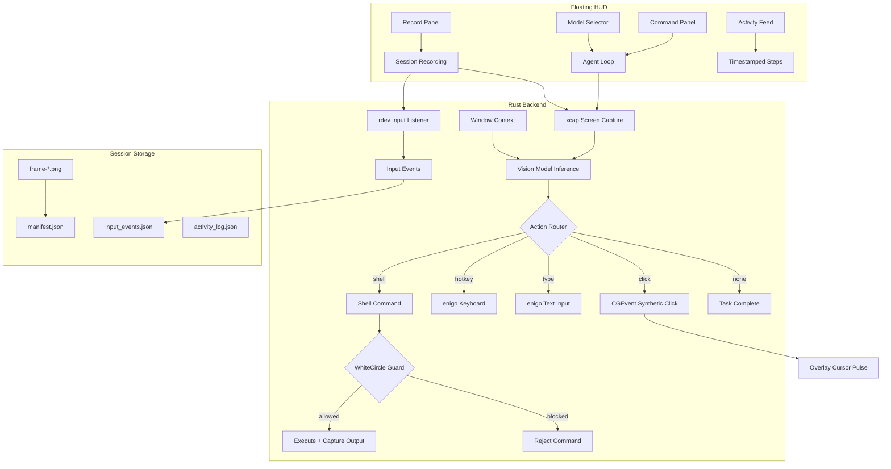

# Agenticify

**OS-native vision automation agent** — record yourself, teach the AI, and let it repeat your workflows autonomously.

Built with **Tauri 2** (Rust backend) + **React** (frontend). Runs natively on macOS with full screen capture, virtual cursor actuation, and a floating HUD that stays out of your way.

---

## Core Capabilities

### Vision-First Agent Loop

- Captures the screen, sends it to a vision model (Mistral API), and executes the model's decision — all in a tight loop.
- Supports **click**, **hotkey**, **type**, **shell** (CLI commands), and **none** (task complete) actions.
- Step history is passed between iterations so the agent remembers what it already did.
- Configurable confidence threshold — low-confidence actions are rejected automatically.
- **Window context awareness** — detects the currently active application and window title, feeding it to the model so it understands the current context.
- **App state awareness** — queries scriptable macOS apps (Spotify, Chrome, Safari, Finder, etc.) via AppleScript for their internal state (player state, current track, active URL, folder path, etc.). Unknown apps get a generic focused-element probe. All queries have a **2-second kill timeout** to prevent hangs.

### Virtual Cursor (CGEvent)

The agent uses **macOS CGEvent synthetic clicks** instead of moving your physical mouse cursor. This means:

- **Your cursor stays put** — the agent clicks at target coordinates via the OS event stream, not by hijacking your mouse.
- **Clicks bypass overlays** — synthetic events go directly to the target window, even through the always-on-top overlay.
- **You keep full control** — use your mouse normally while the agent works.
- `MOUSE_EVENT_CLICK_STATE` is set for proper single-click registration.
- Falls back to `enigo` mouse actuation on non-macOS platforms.

### Click Accuracy Pipeline

Every click goes through a multi-stage precision pipeline:

1. **Pixel coordinates** — the vision model returns `x_norm` / `y_norm` as pixel coordinates within the (possibly downscaled) screenshot image. `(0, 0)` is the top-left corner.
2. **Scale-factor-aware conversion** — pixel coordinates are scaled back to original screenshot pixels, then translated to macOS logical points, accounting for Retina scaling (`2.0x`, `3.0x`) and multi-monitor offsets.
3. **Confidence gating** — each action carries a `confidence` score (0–1). Clicks below the threshold (default `0.60`, configurable via `AGENT_CONFIDENCE_THRESHOLD`) are **automatically rejected**.
4. **Image compression pipeline** — screenshots are compressed before inference to optimize speed and cost:
   - **Adaptive downscaling** — images are resized to fit within `AGENT_INFER_MAX_DIM` (default `2048px`, range `640–4096`) while preserving aspect ratio.
   - **Triangle filter** — uses bilinear interpolation for clean downscaling without aliasing artifacts.
   - **PNG re-encoding** — compressed images are re-encoded as PNG to minimize payload size while staying lossless.
5. **Self-correction** — the system prompt instructs the model to detect missed clicks (no state change) and adjust coordinates toward the element center on retry.
6. **Visual verification** — the transparent overlay shows a pulsing cursor at the exact click target, so you can visually confirm accuracy.
7. **Full telemetry** — every click logs: pixel coords, screenshot dims, scale factor, monitor origin, and final point in logical coordinates.

### Context Injection Pipeline

Every inference call assembles a rich prompt from **7 distinct sources** — this is what the model "sees" and "knows" on each step:

| Layer                         | Source                                                       | Injected Into               | Description                                                                                                                                                                                                                                                       |
| ----------------------------- | ------------------------------------------------------------ | --------------------------- | ----------------------------------------------------------------------------------------------------------------------------------------------------------------------------------------------------------------------------------------------------------------- |
| **1. System Prompt**          | `main.rs` (hardcoded)                                        | `system` message            | Full action schema (click, hotkey, type, shell, none), Spotlight navigation rules, stopping criteria, text editing patterns, click accuracy heuristics, hotkey reference                                                                                          |
| **2. Screenshot**             | `xcap` screen capture                                        | `user` message (image part) | PNG of the primary monitor, adaptively downscaled to `AGENT_INFER_MAX_DIM` (default 2048px). Encoded as base64 data URI                                                                                                                                           |
| **3. Task Instruction**       | User input (HUD / dashboard)                                 | `user` message (text)       | The natural-language goal, e.g. "Open Chrome and go to github.com"                                                                                                                                                                                                |
| **4. Coordinate System**      | Computed from screenshot dims                                | `user` message (text)       | Pixel coordinate bounds: `"The screenshot image is {W}x{H} pixels… (0,0) is top-left…"`                                                                                                                                                                           |
| **5. OS Context**             | `gather_os_context()` via AppleScript                        | `user` message (text)       | **Frontmost app** name + **window title**, **running GUI apps** list, **open window names** in frontmost app, **app-specific state** (e.g. Spotify track, Chrome URL, Finder path — queried via per-app AppleScript with 2s kill timeout), **system time** (unix) |
| **6. App-Specific Shortcuts** | `shortcuts::get_or_fetch_global()` via LLM                   | `user` message (text)       | Top 20 macOS keyboard shortcuts for the frontmost app, dynamically fetched on first encounter and session-cached                                                                                                                                                  |
| **7. Step History**           | `stepHistory[]` (in-memory, frontend) + `getWindowContext()` | `user` message (text)       | Accumulated action log from prior steps in the current run: `"Step 1: click (x,y) — reason"`, `"Step 2: hotkey Cmd+T — reason"`, etc. Includes the currently active window context at the top                                                                     |

**What is NOT persisted**: The full model prompt, raw model response, and thinking/reasoning traces are **not saved** to disk. Only the extracted `VisionAction` (action, coordinates, confidence, reason) survives — optionally written to `activity_log.json` per session. Step history lives in-memory for the duration of one agent run only.

### Model

Uses **Mistral Large 3** (`mistralai/mistral-large-2512`) via the Mistral API for all vision inference. OpenRouter is also supported as an alternative provider.

- Model selection persists across sessions via `localStorage`.
- Saved sessions remember which model was used and auto-select it on replay.

### Shortcuts-First Navigation

The agent **always prefers keyboard shortcuts over clicking** — clicking is the last resort.

- **Dynamic shortcut discovery** — on first encounter with any app (Spotify, Chrome, VS Code, etc.), the agent makes a lightweight LLM call to fetch the top 20 macOS shortcuts for that app.
- **Session-scoped cache** — shortcuts are cached per app name in memory, so subsequent agent steps with the same app pay zero latency.
- **System apps skipped** — loginwindow, Dock, SystemUIServer, and other system processes are automatically excluded.
- **Static fallback** — the system prompt also includes a built-in reference for browser, macOS, Finder, and Terminal shortcuts.
- **Priority order** — app-specific shortcuts → generic hotkeys → clicking (last resort).
- **Wrong-app safety** — if the frontmost app is not the target app, the agent will **never click** (guaranteed wrong target). Instead it uses Cmd+Space Spotlight to switch to the correct app first.

### Floating HUD (Always-On-Top)

A compact, transparent pill that floats above everything — your command center without leaving your workflow.

| Control    | What it does                                    |
| ---------- | ----------------------------------------------- |
| ☰ Menu    | Toggle the main dashboard window                |
| ◉ Record   | Open the session recording panel                |
| ✏️ Command | Type an instruction and run the agent loop      |
| ▼ Activity | Live timestamped feed of every agent step       |
| 🎯 Overlay | Toggle the visual cursor overlay (red when off) |
| ◄ Collapse | Shrink HUD to a single circle, click to expand  |

- **Elapsed timer** shows a running clock (▶ 0:05) during agent runs and (● 0:12) during recording.
- **Activity feed** shows HH:MM:SS timestamps on every step — **auto-opens when the agent starts a task**.
- **Blue glow border** pulses around the entire screen while the agent is actively running.
- **Model selector** — pick a model directly in the HUD's command or record panels.
- Collapsible to a 48px circle centered on screen.

### Session Recording & Replay

Record yourself performing a task — the AI watches, learns, and can repeat it.

**Recording captures:**

- Screen frames (configurable FPS)
- Mouse movements, clicks, and scroll events (via `rdev`)
- Every keystroke — key presses and releases
- Session name, instruction, task context, and selected model

**Replay features:**

- Select any saved session and replay it with the AI
- Auto-fills the instruction from the recording so the AI knows the goal
- Repeat count: run once, N times, or ∞ (infinite loop until stopped)
- Activity logs saved per session for post-run review
- **Save Runs** — toggle in the command panel so every agent run automatically records as a replayable session

### Transparent Overlay

- Full-screen transparent window spanning all monitors.
- Visual cursor shows exactly where the agent clicked — with pulse animations.
- **Blue glow border** — pulsing blue border around the entire screen while the agent is in control.
- The overlay is `pointer-events: none` — the agent's CGEvent clicks pass right through it.

### Safety Controls

- **Global E-STOP**: `Cmd+Shift+Esc` — immediately halts all agent actions.
- **Restore window**: `Cmd+Shift+Enter` — brings the dashboard back if minimized.
- **Max action cap** (30 per run) with auto-stop.
- Per-action confidence threshold gating.

### Shell Commands + WhiteCircle Guardrails

- The agent can run CLI commands via `/bin/sh -c` when a task is better handled through the terminal.
- **WhiteCircle integration** — every shell command is validated through WhiteCircle's guardrail API before execution:
  - **Input guard**: blocks unsafe/malicious commands before they run.
  - **Output guard**: screens command output for sensitive data leaks.
- **Strict mode** (`WHITECIRCLE_STRICT=true`): hard-blocks commands when the guardrail API is unreachable.
- **Graceful degradation**: without an API key, commands execute with a logged warning.
- 10-second timeout per command, 4KB output cap to protect model context.

---

## Architecture



## Session Data Format

```text
session-<unix-ms>/
  manifest.json          # name, instruction, model, fps, frame count, duration, input event count
  activity_log.json      # agent step history
  input_events.json      # mouse moves, clicks, key presses/releases, scroll events
  monitor-<id>/
    frame-000001.png
    frame-000002.png
    ...
```

## Dashboard

| Tab           | Purpose                                                                                                            |
| ------------- | ------------------------------------------------------------------------------------------------------------------ |
| **Run**       | Permissions, API key status, E-STOP, overlay/HUD toggles, model selection, action counter, live command execution  |
| **Sessions**  | Recording status cards, saved session list with names/instructions/input counts, replay with instruction auto-fill |
| **Dev Tools** | Step-by-step capture/infer/click controls, raw state inspection                                                    |

---

## Tech Stack

| Layer               | Technology                                |
| ------------------- | ----------------------------------------- |
| Framework           | Tauri 2 (Rust + WebView)                  |
| Frontend            | React + TypeScript + Vite                 |
| Screen Capture      | `xcap`                                    |
| Mouse Click         | `core-graphics` CGEvent (virtual cursor)  |
| Keyboard Actuation  | `enigo`                                   |
| Input Event Capture | `rdev` (global mouse/keyboard listener)   |
| Vision Model        | Mistral API (OpenRouter also supported)   |
| HTTP Client         | `reqwest` + `openrouter-rs`               |
| AI Guardrails       | WhiteCircle API (input/output protection) |
| Styling             | Vanilla CSS with glassmorphism, dark mode |

## Environment

Create `.env` in repo root:

```bash
# Mistral API (primary)
MISTRAL_API_KEY=YOUR_MISTRAL_API_KEY
MISTRAL_API_BASE=https://api.mistral.ai/v1

# Or use OpenRouter instead
# OPENROUTER_API_KEY=YOUR_OPENROUTER_KEY
# OPENROUTER_API_BASE=https://openrouter.ai/api/v1

AGENT_CONFIDENCE_THRESHOLD=0.60
AGENT_INFER_MAX_DIM=2048

# WhiteCircle Guardrails (for shell command safety)
WHITECIRCLE_API_KEY=YOUR_WHITECIRCLE_KEY
WHITECIRCLE_API_BASE=https://eu.whitecircle.ai/api/v1
WHITECIRCLE_STRICT=true
```

## Run

```bash
bun install
bun run tauri:dev
```

Requires macOS with **Screen Recording** and **Accessibility** permissions (prompted on first launch).

## Backend Commands

### Core

| Command                  | Description                                     |
| ------------------------ | ----------------------------------------------- |
| `capture_primary_cmd`    | Capture primary monitor screenshot              |
| `infer_click_cmd`        | Send screenshot + instruction to vision model   |
| `execute_real_click_cmd` | Perform CGEvent synthetic click at pixel coords |
| `press_keys_cmd`         | Execute keyboard shortcuts                      |
| `type_text_cmd`          | Type text string                                |
| `run_shell_cmd`          | Execute shell command with WhiteCircle guard    |
| `get_frontmost_app_cmd`  | Get active window name and title                |

### Sessions (recording.rs)

| Command                 | Description                                   |
| ----------------------- | --------------------------------------------- |
| `start_session_cmd`     | Start recording (frames + rdev input capture) |
| `stop_session_cmd`      | Stop recording, save manifest + input events  |
| `session_status_cmd`    | Get current recording status                  |
| `list_sessions_cmd`     | List all saved sessions                       |
| `load_session_cmd`      | Load a specific session manifest              |
| `delete_session_cmd`    | Delete a saved session                        |
| `save_activity_log_cmd` | Save agent activity log to session            |
| `load_activity_log_cmd` | Load saved activity log from session          |

### System

| Command                     | Description                                       |
| --------------------------- | ------------------------------------------------- |
| `check_permissions_cmd`     | Check macOS permissions                           |
| `request_permissions_cmd`   | Prompt for permissions                            |
| `set_estop_cmd`             | Toggle emergency stop                             |
| `get_runtime_state_cmd`     | Get runtime state (E-STOP, action count)          |
| `get_app_shortcuts_cmd`     | Fetch/cache keyboard shortcuts for an app via LLM |
| `clear_shortcuts_cache_cmd` | Clear the in-memory shortcuts cache               |
