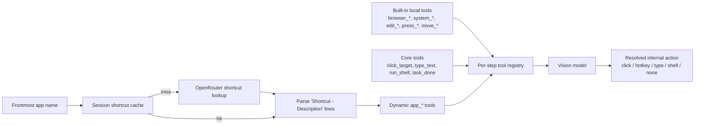
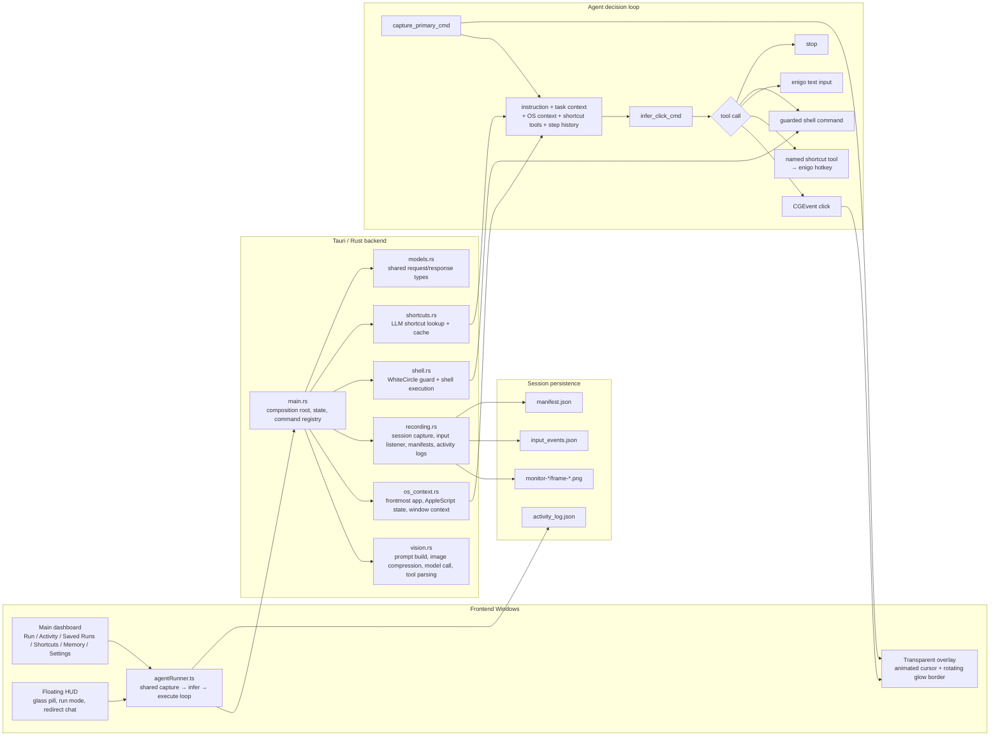

# Computer Use

**OS-native vision automation agent** — record yourself, teach the AI, and let it repeat your workflows autonomously.

Built with **Tauri 2** (Rust backend) + **React** (frontend). Runs natively on macOS with full screen capture, virtual cursor actuation, and a floating HUD that stays out of your way.

---

## Core Capabilities

### Vision-First Agent Loop

- Captures the screen, sends it to a vision model (via OpenRouter or direct API), and executes the model's decision — all in a tight loop.
- The model now selects **named tools** instead of emitting raw action JSON. Core tools are `click_target`, `type_text`, `run_shell`, and `task_done`, plus a catalog of named shortcut tools such as `browser_new_tab` and `system_open_spotlight`.
- Tool calls are still normalized into the internal action types **click**, **hotkey**, **type**, **shell**, and **none** for execution, telemetry, and session logs.
- Step history is passed between iterations so the agent remembers what it already did.
- Configurable confidence threshold — low-confidence actions are rejected automatically.
- **Window context awareness** — detects the currently active application and window title, feeding it to the model so it understands the current context.
- **App state awareness** — queries scriptable macOS apps (Spotify, Chrome, Safari, Finder, etc.) via AppleScript for their internal state (player state, current track, active URL, folder path, etc.). Unknown apps get a generic focused-element probe. All queries have a **2-second kill timeout** to prevent hangs.

### Virtual Cursor (CGEvent)

The agent uses **macOS CGEvent synthetic clicks** instead of moving your physical mouse cursor. This means:

- **Your cursor stays put** — the agent clicks at target coordinates via the OS event stream, not by hijacking your mouse.
- **Clicks bypass overlays** — synthetic events go directly to the target window, even through the always-on-top overlay.
- **You keep full control** — use your mouse normally while the agent works.
- `MOUSE_EVENT_CLICK_STATE` is set for proper single-click registration.
- Falls back to `enigo` mouse actuation on non-macOS platforms.

### Click Accuracy Pipeline

Every click goes through a multi-stage precision pipeline:

1. **Pixel coordinates** — the vision model returns `x_norm` / `y_norm` as pixel coordinates within the (possibly downscaled) screenshot image. `(0, 0)` is the top-left corner.
2. **Scale-factor-aware conversion** — pixel coordinates are scaled back to original screenshot pixels, then translated to macOS logical points, accounting for Retina scaling (`2.0x`, `3.0x`) and multi-monitor offsets.
3. **Confidence gating** — each action carries a `confidence` score (0–1). Clicks below the threshold (default `0.60`, configurable via `AGENT_CONFIDENCE_THRESHOLD`) are **automatically rejected**.
4. **Image compression pipeline** — screenshots are compressed before inference to optimize speed and cost:
   - **Adaptive downscaling** — images are resized to fit within `AGENT_INFER_MAX_DIM` (default `2048px`, range `640–4096`) while preserving aspect ratio.
   - **Triangle filter** — uses bilinear interpolation for clean downscaling without aliasing artifacts.
   - **PNG re-encoding** — compressed images are re-encoded as PNG to minimize payload size while staying lossless.
5. **Self-correction** — the system prompt instructs the model to detect missed clicks (no state change) and adjust coordinates toward the element center on retry.
6. **Visual verification** — the transparent overlay shows a pulsing cursor at the exact click target, so you can visually confirm accuracy.
7. **Full telemetry** — every click logs: pixel coords, screenshot dims, scale factor, monitor origin, and final point in logical coordinates.

### Context Injection Pipeline

Every inference call assembles a rich prompt from **7 distinct sources** — this is what the model "sees" and "knows" on each step:

| Layer                         | Source                                                       | Injected Into               | Description                                                                                                                                                                                                                                                       |
| ----------------------------- | ------------------------------------------------------------ | --------------------------- | ----------------------------------------------------------------------------------------------------------------------------------------------------------------------------------------------------------------------------------------------------------------- |
| **1. System Prompt**          | `system_prompt.txt` (loaded via `include_str!`)              | `system` message            | 5-gate decision flow (objective → login detection → app check → last action → next action), tool-calling instructions, Spotlight rules, click accuracy heuristics, and shortcut-tool preference                                                                    |
| **2. Screenshot**             | `CGWindowListCreateImage` (excludes HUD) / `xcap` fallback  | `user` message (image part) | PNG of the primary monitor with HUD/overlay excluded, adaptively downscaled to `AGENT_INFER_MAX_DIM` (default 2048px). Encoded as base64 data URI                                                                                                                 |
| **3. Task Instruction**       | User input (HUD / dashboard)                                 | `user` message (text)       | The natural-language goal, e.g. "Open Chrome and go to github.com"                                                                                                                                                                                                |
| **4. Coordinate System**      | Computed from screenshot dims                                | `user` message (text)       | Pixel coordinate bounds: `"The screenshot image is {W}x{H} pixels… (0,0) is top-left…"`                                                                                                                                                                           |
| **5. OS Context**             | `gather_os_context()` via AppleScript                        | `user` message (text)       | **Frontmost app** name + **window title**, **running GUI apps** list, **open window names** in frontmost app, **app-specific state** (e.g. Spotify track, Chrome URL, Finder path — queried via per-app AppleScript with 2s kill timeout), **system time** (unix) |
| **6. App-Specific Shortcuts** | `shortcuts::get_or_fetch_global()` via LLM                   | `user` message (text)       | Top 20 macOS keyboard shortcuts for the frontmost app, dynamically fetched on first encounter, parsed into `app_*` tool definitions when possible, and session-cached                                                                                            |
| **7. Step History**           | `stepHistory[]` (in-memory, frontend) + `getWindowContext()` | `user` message (text)       | Accumulated action log from prior steps in the current run: `"Step 1: click (x,y) — reason"`, `"Step 2: hotkey Meta+t+Meta — reason"`, etc. Includes the currently active window context at the top                                                              |

**What is NOT persisted**: The full model prompt, raw model response, and thinking/reasoning traces are **not saved** to disk. Only the extracted `VisionAction` (action, coordinates, confidence, reason) survives — optionally written to `activity_log.json` per session. Step history lives in-memory for the duration of one agent run only.

### Models

Vision inference routes through **OpenRouter**, so you can switch models without changing API keys. Currently supported:

| ID                                              | Label                              |
| ----------------------------------------------- | ---------------------------------- |
| `mistralai/mistral-large-2512`                  | Mistral Large 3 (default)          |
| `qwen/qwen3.5-35b-a3b`                         | Qwen 3.5 35B A3B                   |
| `openai/gpt-5.4`                                | GPT-5.4                            |
| `anthropic/claude-sonnet-4.6`                    | Claude Sonnet 4.6                  |
| `google/gemini-3.1-pro-preview-customtools`     | Gemini 3.1 Pro Preview (Custom Tools) |

- Model selection persists across sessions via `localStorage`.
- Saved sessions remember which model was used and auto-select it on replay.
- **Cost tracking** — each inference returns token usage and estimated USD cost via OpenRouter pricing API, with fallback to a built-in pricing table for known models (GPT-4o, Claude, Gemini, Mistral, Llama). Totals are logged per run and per replay.

### Shortcuts-First Navigation

The agent **always prefers keyboard shortcuts over clicking** — clicking is the last resort.

- **Dynamic shortcut discovery** — on first encounter with any app (Spotify, Chrome, VS Code, etc.), the agent makes a lightweight LLM call to fetch the top 20 macOS shortcuts for that app.
- **Session-scoped cache** — shortcuts are cached per app name in memory, so subsequent agent steps with the same app pay zero latency.
- **System apps skipped** — loginwindow, Dock, SystemUIServer, and other system processes are automatically excluded.
- **Static fallback** — the system prompt also includes a built-in catalog of named shortcut tools for browser, macOS, editing, and navigation actions.
- **Priority order** — app-specific `app_*` tools → built-in shortcut tools → clicking (last resort).
- **Wrong-app safety** — if the frontmost app is not the target app, the agent checks the Dock and installed native apps first (Linear, Slack, Notion, Discord, Spotify, etc.) before falling back to Spotlight. Prefers native macOS apps over browser-based alternatives.

### Tool Catalog

The model is expected to call exactly one tool on each step. These are the built-in tools currently registered in `vision.rs`.



#### Core tools

| Tool | Meaning |
| ---- | ------- |
| `click_target` | Click a target using pixel coordinates from the current screenshot |
| `type_text` | Type text into the currently focused control |
| `run_shell` | Run a shell command when the user explicitly asked for terminal/CLI work |
| `task_done` | Mark the task complete when the goal is visually confirmed |

#### Browser shortcut tools

| Tool | Shortcut |
| ---- | -------- |
| `browser_focus_address_bar` | `Cmd+L` |
| `browser_new_tab` | `Cmd+T` |
| `browser_close_tab` | `Cmd+W` |
| `browser_reload` | `Cmd+R` |
| `browser_back` | `Cmd+[` |
| `browser_forward` | `Cmd+]` |

#### System and editing shortcut tools

| Tool | Shortcut |
| ---- | -------- |
| `system_open_spotlight` | `Cmd+Space` |
| `system_quit_app` | `Cmd+Q` |
| `edit_select_all` | `Cmd+A` |
| `edit_copy` | `Cmd+C` |
| `edit_paste` | `Cmd+V` |
| `file_save` | `Cmd+S` |

#### Navigation and keypress tools

| Tool | Shortcut |
| ---- | -------- |
| `press_return` | `Return` |
| `press_escape` | `Escape` |
| `press_tab` | `Tab` |
| `press_shift_tab` | `Shift+Tab` |
| `press_space` | `Space` |
| `press_backspace` | `Backspace` |
| `press_delete` | `Delete` |
| `move_up` | `Up` |
| `move_down` | `Down` |
| `move_left` | `Left` |
| `move_right` | `Right` |
| `press_home` | `Home` |
| `press_end` | `End` |
| `press_page_up` | `PageUp` |
| `press_page_down` | `PageDown` |

#### Dynamic app-specific tools

- When app shortcuts can be parsed into a single key combo, the backend registers additional tools named like `app_new_tab`, `app_toggle_sidebar`, or `app_move_tab_left`.
- These dynamic tools are derived from `Shortcut - Description` lines returned by `get_app_shortcuts_cmd`.
- If a shortcut line cannot be parsed into one combo, it is kept as prompt context only and does not become a callable tool.

### Floating HUD (Always-On-Top)

A compact, transparent pill that floats above everything — your command center without leaving your workflow.

| Control    | What it does                                    |
| ---------- | ----------------------------------------------- |
| ☰ Menu    | Toggle the main dashboard window                |
| ▶ Run      | Start the agent loop                            |
| ✏️ Command | Type an instruction and run the agent loop      |
| ▼ Activity | Live timestamped feed of every agent step       |
| ◄ Collapse | Shrink HUD to a single circle, click to expand  |
| ⋮ Grip    | Drag the HUD to reposition it on screen         |

- **Apple glass aesthetic** — frosted translucent background with `backdrop-filter: blur(40px)`, subtle inset highlights, and smooth 250ms transition to opaque when macOS drops blur on unfocused windows.
- **Run mode UX** — when the agent starts running, the input box is replaced by a task summary pill showing the current instruction. The stop button becomes a pause/resume toggle. A redirect chat input appears inside the activity panel to change the agent's goal mid-run while preserving previous context.
- **Elapsed timer** shows a running clock (▶ 0:05) during agent runs and (● 0:12) during recording.
- **Activity feed** shows HH:MM:SS timestamps on every step — **auto-opens when the agent starts a task**.
- **Blue glow border** pulses around the entire screen while the agent is actively running.
- **Model selector** — pick a model directly in the HUD's command or record panels.
- **Save Run** — after a run completes, a save button appears in both the HUD and activity panel to persist the run for deterministic replay.
- Collapsible to a draggable 28px circle centered on screen.

### Session Recording & Replay

Record yourself performing a task — the AI watches, learns, and can repeat it.

The backend now uses a single session recording implementation in `recording.rs`. The older screenshot-only recorder has been removed, so the dashboard and HUD both talk to the same session lifecycle.

**Recording captures:**

- Screen frames (configurable FPS)
- Mouse movements, clicks, and scroll events (via `rdev`)
- Every keystroke — key presses and releases
- Session name, instruction, task context, and selected model

**Replay features:**

- Select any saved session and replay it with the AI
- Auto-fills the instruction from the recording so the AI knows the goal
- Repeat count: run once, N times, or ∞ (infinite loop until stopped)
- Activity logs saved per session for post-run review
- **Save Runs** — toggle in the command panel so every agent run automatically records as a replayable session

### HUD-Excluded Screen Capture

- Screen captures use **macOS `CGWindowListCreateImage`** with `kCGWindowListOptionOnScreenBelowWindow` to capture the entire desktop **excluding the HUD and overlay windows**.
- The capture function finds the app's topmost window (highest z-layer) via `CGWindowListCopyWindowInfo` matching the process PID, then captures everything below it.
- Falls back to `xcap` full-screen capture if the native API fails.
- No more hiding/showing windows — zero flicker, clean captures every time.

### Transparent Overlay

- Full-screen transparent window spanning all monitors.
- Visual cursor shows exactly where the agent clicked — with pulse animations.
- **Animated glow border** — rotating conic-gradient beam that continuously travels around the screen edge (3s rotation) combined with pulsing blue box-shadows (2s breathe cycle). Uses CSS `@property` for smooth custom property animation.
- The overlay is `pointer-events: none` — the agent's CGEvent clicks pass right through it.

### Safety Controls

- **Global E-STOP**: `Cmd+Shift+Esc` — immediately halts all agent actions.
- **Restore window**: `Cmd+Shift+Enter` — brings the dashboard back if minimized.
- **Max action cap** (configurable: 30, 50, 100, or ∞) with auto-stop. Adjustable in the Settings tab.
- Per-action confidence threshold gating.

### Settings Tab (formerly Dev Tools)

The Settings tab provides operational controls in four panels:

- **System Status** — at-a-glance view of screen recording permission, accessibility permission, API key status, and E-STOP state with refresh/request buttons.
- **API Configuration** — validate API key and open the config folder directly in Finder.
- **Safety Controls** — E-STOP toggle, action counter, and max steps hard cap selector (30/50/100/∞ presets or custom number input).
- **Data & Storage** — open recordings and saved runs folders in Finder, showing the full paths.
- **Cursor Preview & Test** — interactive test area to preview and customize the agent cursor (size slider, color presets).

### Shell Commands + WhiteCircle Guardrails

- The agent can run CLI commands via `/bin/sh -c` when a task is better handled through the terminal.
- **WhiteCircle integration** — every shell command is validated through WhiteCircle's guardrail API before execution:
  - **Input guard**: blocks unsafe/malicious commands before they run.
  - **Output guard**: screens command output for sensitive data leaks.
- **Strict mode** (`WHITECIRCLE_STRICT=true`): hard-blocks commands when the guardrail API is unreachable.
- **Graceful degradation**: without an API key, commands execute with a logged warning.
- 10-second timeout per command, 4KB output cap to protect model context.

---

## Architecture



## Backend Architecture

The Rust backend is no longer a monolithic `main.rs`. `main.rs` is now the Tauri composition root: it owns shared runtime state, low-level input/capture helpers, plugin setup, and command registration. The feature logic lives in focused modules:

```text
src-tauri/src/
├── main.rs             # app setup, shared helpers, command wiring, CGWindowList capture
├── models.rs           # shared request/response and runtime types
├── vision.rs           # prompt assembly, screenshot preprocessing, tool registry, response parsing, cost estimation
├── system_prompt.txt   # externalized system prompt (loaded via include_str!)
├── os_context.rs       # AppleScript-based app/window/system context
├── recording.rs        # session recording, input capture, manifest/activity persistence
├── shell.rs            # WhiteCircle validation and shell command execution
└── shortcuts.rs        # app shortcut discovery and in-memory caching
```

This split matters for debugging: session issues stay in `recording.rs`, model/output issues stay in `vision.rs`, and macOS context problems stay in `os_context.rs` instead of being buried in one multi-thousand-line file.

## Frontend Architecture

The frontend is split into focused modules for maintainability:

```
src/
├── App.tsx                       # Router — delegates to window components
├── types.ts                      # Shared TypeScript type definitions
├── constants.ts                  # Labels, model options, dimensions
├── lib/
│   ├── tauri.ts                 # Tauri invoke wrappers, window management
│   └── agentRunner.ts           # Deduplicated capture→infer→execute loop
├── hooks/
│   └── useAgentLoop.ts          # Agent loop state & controls
├── components/
│   ├── OverlayWindow.tsx        # Transparent cursor overlay
│   ├── HudWindow.tsx            # Floating HUD pill (activity, command, record)
│   ├── MainApp.tsx              # Dashboard orchestrator
│   ├── RunTab.tsx               # Run tab — health + live command
│   ├── SessionsTab.tsx          # Sessions tab — recording + replay
│   ├── DevTab.tsx               # Dev Tools tab — step controls + raw data
│   ├── HealthGrid.tsx           # Reusable status chip grid
│   ├── ModelActivityPanel.tsx   # Model activity sidebar
│   └── ActivityLogPanel.tsx     # Activity log sidebar
├── HudWidgets.tsx               # ElapsedTimer, ActivityFeed components
├── shortcuts.tsx                # App shortcut fetching
├── taskRunLock.ts               # Task run mutex via backend
├── main.tsx                     # React entry point
└── styles.css                   # All styling (dark/light, glassmorphism)
```

The agent loop logic (`capture → infer → execute → emit`) lives in a single `agentRunner.ts` module, shared by both the HUD and the main dashboard — no duplication.

## Session Data Format

```text
session-<unix-ms>/
  manifest.json          # name, instruction, model, fps, frame count, duration, input event count
  activity_log.json      # agent step history
  input_events.json      # mouse moves, clicks, key presses/releases, scroll events
  monitor-<id>/
    frame-000001.png
    frame-000002.png
    ...
```

## Dashboard

| Tab           | Purpose                                                                                                            |
| ------------- | ------------------------------------------------------------------------------------------------------------------ |
| **Run**       | Permissions, API key status, E-STOP, overlay/HUD toggles, model selection, action counter, live command execution  |
| **Sessions**  | Recording status cards, saved session list with names/instructions/input counts, replay with instruction auto-fill |
| **Dev Tools** | Step-by-step capture/infer/click controls, raw state inspection                                                    |

---

## Tech Stack

| Layer               | Technology                                                    |
| ------------------- | ------------------------------------------------------------- |
| Framework           | Tauri 2 (Rust + WebView)                                      |
| Frontend            | React + TypeScript + Vite                                     |
| Screen Capture      | `CGWindowListCreateImage` (HUD-excluded) / `xcap` (fallback)  |
| Mouse Click         | `core-graphics` CGEvent (virtual cursor)                      |
| Keyboard Actuation  | `enigo`                                                       |
| Input Event Capture | `rdev` (global mouse/keyboard listener)                       |
| Vision Model        | OpenRouter (any model) / direct API                           |
| HTTP Client         | `reqwest`                                                     |
| AI Guardrails       | WhiteCircle API (input/output protection) |
| Styling             | Vanilla CSS with glassmorphism, dark mode |

## Environment

Create `.env` in repo root:

```bash
OPENROUTER_API_KEY=YOUR_OPENROUTER_API_KEY
OPENROUTER_API_BASE=https://openrouter.ai/api/v1

AGENT_CONFIDENCE_THRESHOLD=0.60
AGENT_INFER_MAX_DIM=2048

# WhiteCircle Guardrails (for shell command safety)
WHITECIRCLE_API_KEY=YOUR_WHITECIRCLE_KEY
WHITECIRCLE_API_BASE=https://eu.whitecircle.ai/api/v1
WHITECIRCLE_STRICT=true
```

## Run

```bash
bun install
bun run tauri:dev
```

This repo is Bun-only on the frontend side. Use `bun run build` for production assets and avoid `npm`, `pnpm`, or `yarn`.

Requires macOS with **Screen Recording** and **Accessibility** permissions (prompted on first launch).

## Backend Commands

### Core

| Command                  | Description                                     |
| ------------------------ | ----------------------------------------------- |
| `capture_primary_cmd`    | Capture primary monitor screenshot (HUD-excluded via CGWindowList) |
| `infer_click_cmd`        | Send screenshot + instruction to vision model and resolve one tool call |
| `execute_real_click_cmd` | Perform CGEvent synthetic click at pixel coords |
| `press_keys_cmd`         | Execute resolved shortcut key sequences         |
| `type_text_cmd`          | Type text string                                |
| `run_shell_cmd`          | Execute shell command with WhiteCircle guard    |
| `get_frontmost_app_cmd`  | Get active window name and title                |
| `open_path_cmd`          | Open a folder or file in Finder                 |
| `export_markdown_cmd`    | Export recorded activity as Markdown            |

### Sessions (recording.rs)

| Command                 | Description                                   |
| ----------------------- | --------------------------------------------- |
| `recordings_root_cmd`   | Return the root folder for all saved sessions |
| `start_session_cmd`     | Start recording (frames + rdev input capture) |
| `stop_session_cmd`      | Stop recording, save manifest + input events  |
| `session_status_cmd`    | Get current recording status                  |
| `list_sessions_cmd`     | List all saved sessions                       |
| `load_session_cmd`      | Load a specific session manifest              |
| `delete_session_cmd`    | Delete a saved session                        |
| `save_activity_log_cmd` | Save agent activity log to session            |
| `load_activity_log_cmd` | Load saved activity log from session          |

### System

| Command                     | Description                                       |
| --------------------------- | ------------------------------------------------- |
| `check_permissions_cmd`     | Check macOS permissions                           |
| `request_permissions_cmd`   | Prompt for permissions                            |
| `set_estop_cmd`             | Toggle emergency stop                             |
| `get_runtime_state_cmd`     | Get runtime state (E-STOP, action count)          |
| `get_app_shortcuts_cmd`     | Fetch/cache keyboard shortcuts for an app via LLM |
| `clear_shortcuts_cache_cmd` | Clear the in-memory shortcuts cache               |

---

Prev. Agenticify.
