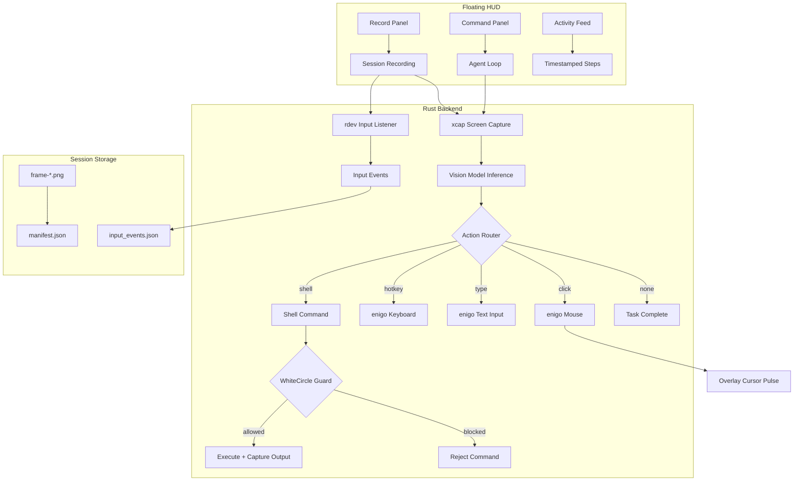

# Agenticify

**OS-native vision automation agent** — record yourself, teach the AI, and let it repeat your workflows autonomously.

Built with **Tauri 2** (Rust backend) + **React** (frontend). Runs natively on macOS with full screen capture, mouse/keyboard actuation, and a floating HUD that stays out of your way.

---

## Core Capabilities

### Vision-First Agent Loop

- Captures the screen, sends it to a vision model (OpenRouter / Mistral), and executes the model's decision — all in a tight loop.
- Supports **click**, **hotkey**, **type**, **shell** (CLI commands), and **none** (task complete) actions.
- Step history is passed between iterations so the agent remembers what it already did.
- Configurable confidence threshold — low-confidence actions are rejected automatically.

### Floating HUD (Always-On-Top)

A compact, transparent pill that floats above everything — your command center without leaving your workflow.

| Control    | What it does                                    |
| ---------- | ----------------------------------------------- |
| ☰ Menu    | Toggle the main dashboard window                |
| ◉ Record   | Open the session recording panel                |
| ✏️ Command | Type an instruction and run the agent loop      |
| ▼ Activity | Live timestamped feed of every agent step       |
| 🎯 Overlay | Toggle the visual cursor overlay (red when off) |
| ◄ Collapse | Shrink HUD to a single circle, click to expand  |

- **Elapsed timer** shows a running clock (▶ 0:05) during agent runs and (● 0:12) during recording.
- **Activity feed** shows HH:MM:SS timestamps on every step.
- Collapsible to a 40px circle centered on screen.

### Session Recording & Replay

Record yourself performing a task — the AI watches, learns, and can repeat it.

**Recording captures:**

- Screen frames (configurable FPS)
- Mouse movements, clicks, and scroll events (via `rdev`)
- Every keystroke — key presses and releases
- Session name and instruction (what you're trying to do)

**Replay features:**

- Select any saved session and replay it with the AI
- Auto-fills the instruction from the recording so the AI knows the goal
- Repeat count: run once, N times, or ∞ (infinite loop until stopped)
- Input events saved as `input_events.json` for full reconstruction

**Save Runs:** Toggle "Save run" in the command panel — every agent run automatically records as a replayable session (frames + all input events captured during execution).

### Transparent Overlay

- Full-screen transparent window spanning all monitors.
- Visual cursor shows exactly where the agent plans to click — with pulse animations.
- Target icon in HUD: default color when active, red when disabled.

### Safety Controls

- **Global E-STOP**: `Cmd+Shift+Esc` — immediately halts all agent actions.
- **Restore window**: `Cmd+Shift+Enter` — brings the dashboard back if minimized.
- **Max action cap** (30 per run) with auto-stop.
- Per-action confidence threshold gating.

### Shell Commands + WhiteCircle Guardrails

- The agent can run CLI commands via `/bin/sh -c` when a task is better handled through the terminal (file ops, git, installs, scripts).
- **WhiteCircle integration** — every shell command is validated through WhiteCircle's guardrail API before execution:
  - **Input guard**: blocks unsafe/malicious commands before they run.
  - **Output guard**: screens command output for sensitive data leaks.
- **Strict mode** (`WHITECIRCLE_STRICT=true`): hard-blocks commands when the guardrail API is unreachable.
- **Graceful degradation**: without an API key, commands execute with a logged warning.
- 10-second timeout per command, 4KB output cap to protect model context.

---

## Architecture



## Session Data Format

```text
session-<unix-ms>/
  manifest.json          # name, instruction, fps, frame count, duration, input event count
  input_events.json      # mouse moves, clicks, key presses/releases, scroll events
  monitor-<id>/
    frame-000001.png
    frame-000002.png
    ...
```

**manifest.json:**

```json
{
  "session_id": "session-1709312400000",
  "name": "Open Chrome and search",
  "instruction": "Open Chrome, navigate to google.com, search for Tauri",
  "fps": 2,
  "frame_ticks": 24,
  "duration_ms": 12000,
  "input_event_count": 142
}
```

## Dashboard

| Tab           | Purpose                                                                                                            |
| ------------- | ------------------------------------------------------------------------------------------------------------------ |
| **Run**       | Permissions, API key status, E-STOP, overlay/HUD toggles, action counter, live command execution                   |
| **Sessions**  | Recording status cards, saved session list with names/instructions/input counts, replay with instruction auto-fill |
| **Dev Tools** | Step-by-step capture/infer/click controls, raw state inspection                                                    |

All status indicators use clean health-card style — no raw JSON dumps.

---

## Tech Stack

| Layer                    | Technology                                |
| ------------------------ | ----------------------------------------- |
| Framework                | Tauri 2 (Rust + WebView)                  |
| Frontend                 | React + TypeScript + Vite                 |
| Screen Capture           | `xcap`                                    |
| Mouse/Keyboard Actuation | `enigo`                                   |
| Input Event Capture      | `rdev` (global mouse/keyboard listener)   |
| Vision Model             | OpenRouter API (Mistral, configurable)    |
| HTTP Client              | `reqwest` + `openrouter-rs`               |
| AI Guardrails            | WhiteCircle API (input/output protection) |
| Styling                  | Vanilla CSS with glassmorphism, dark mode |

## Environment

Create `.env` in repo root:

```bash
OPENROUTER_API_KEY=YOUR_OPENROUTER_KEY
OPENROUTER_API_BASE=https://openrouter.ai/api/v1
AGENT_CONFIDENCE_THRESHOLD=0.60
AGENT_INFER_MAX_DIM=960

# WhiteCircle Guardrails (for shell command safety)
WHITECIRCLE_API_KEY=YOUR_WHITECIRCLE_KEY
WHITECIRCLE_API_BASE=https://eu.whitecircle.ai/api/v1
WHITECIRCLE_STRICT=true
```

## Run

```bash
bun install
bun run tauri:dev
```

Requires macOS with **Screen Recording** and **Accessibility** permissions (prompted on first launch).

## Backend Commands

### Core

| Command                  | Description                                   |
| ------------------------ | --------------------------------------------- |
| `capture_primary_cmd`    | Capture primary monitor screenshot            |
| `infer_click_cmd`        | Send screenshot + instruction to vision model |
| `execute_real_click_cmd` | Perform mouse click at normalized coordinates |
| `press_keys_cmd`         | Execute keyboard shortcuts                    |
| `type_text_cmd`          | Type text string                              |
| `run_shell_cmd`          | Execute shell command with WhiteCircle guard  |

### Sessions (recording.rs)

| Command              | Description                                   |
| -------------------- | --------------------------------------------- |
| `start_session_cmd`  | Start recording (frames + rdev input capture) |
| `stop_session_cmd`   | Stop recording, save manifest + input events  |
| `session_status_cmd` | Get current recording status                  |
| `list_sessions_cmd`  | List all saved sessions                       |
| `load_session_cmd`   | Load a specific session manifest              |
| `delete_session_cmd` | Delete a saved session                        |

### System

| Command                   | Description                              |
| ------------------------- | ---------------------------------------- |
| `check_permissions_cmd`   | Check macOS permissions                  |
| `request_permissions_cmd` | Prompt for permissions                   |
| `set_estop_cmd`           | Toggle emergency stop                    |
| `get_runtime_state_cmd`   | Get runtime state (E-STOP, action count) |
