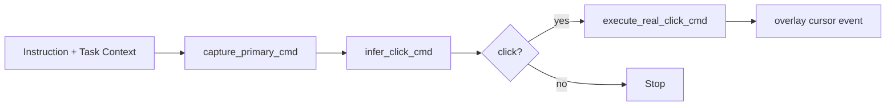
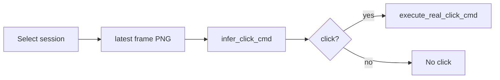

# Agenticify Walkthrough

## 1. Install + Start

```bash
bun install
bun run tauri:dev
```

This starts:
- Vite frontend
- Tauri app bundle (`Agenticify`) with Rust backend
- Overlay window (transparent, always-on-top) for agent cursor visualization
- Top HUD window (always-on-top status strip)

## 2. Configure Provider

Create `.env` in `/Users/xiao/Agenticify`:

```bash
OPENROUTER_API_KEY=YOUR_OPENROUTER_KEY
OPENROUTER_API_BASE=https://openrouter.ai/api/v1
# optional fallback:
MISTRAL_API_KEY=YOUR_MISTRAL_KEY
MISTRAL_API_BASE=https://api.mistral.ai/v1
AGENT_CONFIDENCE_THRESHOLD=0.60
```

Then restart `bun run tauri:dev`.

## 3. Grant macOS Permissions

In Agenticify:
1. Open **Run** tab.
2. Click `Request` in the permissions section.
3. Enable:
   - Screen Recording
   - Accessibility

## 4. Run a Real One-Shot Action

In **Run** tab:
1. Enter instruction (example: `Click the Save button`).
2. Fill `Task Context` with the goal/constraints you want the model to follow.
3. Click `Run One-Shot`.
4. Watch the overlay cursor animate at the target point.

Behind the scenes:
1. Capture screenshot
2. Infer action via Mistral
3. Translate coordinates
4. Execute real click via `enigo`
5. Emit cursor event to overlay (`agent_cursor_event`)



## 5. Record a Real Session

In **Sessions** tab:
1. Click `Start Recording`.
2. Perform your real OS workflow (entire desktop is captured).
3. Click `Stop & Save`.

## 6. Replay a Saved Session

In **Sessions** tab:
1. Select a saved session row.
2. Set instruction/model if needed.
3. Click `Replay Session`.

This uses latest frame from that session and performs real infer + click.



## 7. Find Stored Data

In **Sessions**:
- Click `Open Root Folder` for the root directory.
- Click `Open` on any session row for that specific session.

Typical macOS location:

```text
/var/folders/.../T/agenticify-recordings/
```

Session structure:

```text
session-<unix-ms>/
  manifest.json
  monitor-<id>/frame-000001.png
```

## 8. Safety

- Global kill switch: `Cmd+Shift+Esc`
- UI buttons:
  - `Force E-STOP`
  - `Clear E-STOP`
- Overlay controls (header):
  - `Show Overlay` / `Hide Overlay`
  - `Preview Cursor`
- Overlay is sized to virtual desktop bounds using all available monitors.
- Overlay pass-through is auto-reinforced in runtime so full-screen overlay does not block desktop clicks.
- Top HUD controls (header):
  - `Show Top HUD` / `Hide Top HUD`
- If main window is minimized/hidden:
  - Double-click the top notch to restore Agenticify window
  - Or press `Cmd+Shift+Enter` to force restore main window

If E-STOP is on, clicks are blocked.

## 9. Troubleshooting

- `MISTRAL_API_KEY is not set`
  - Add key to `.env`, restart `bun run tauri:dev`.
- Capture fails
  - Recheck Screen Recording permission.
- Click fails
  - Recheck Accessibility permission and clear E-STOP.
- Vite/esbuild `The service was stopped`
  - Run `bun install` and retry.
